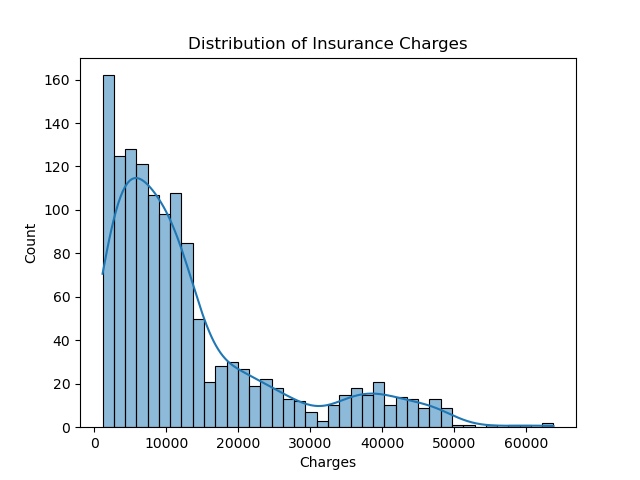
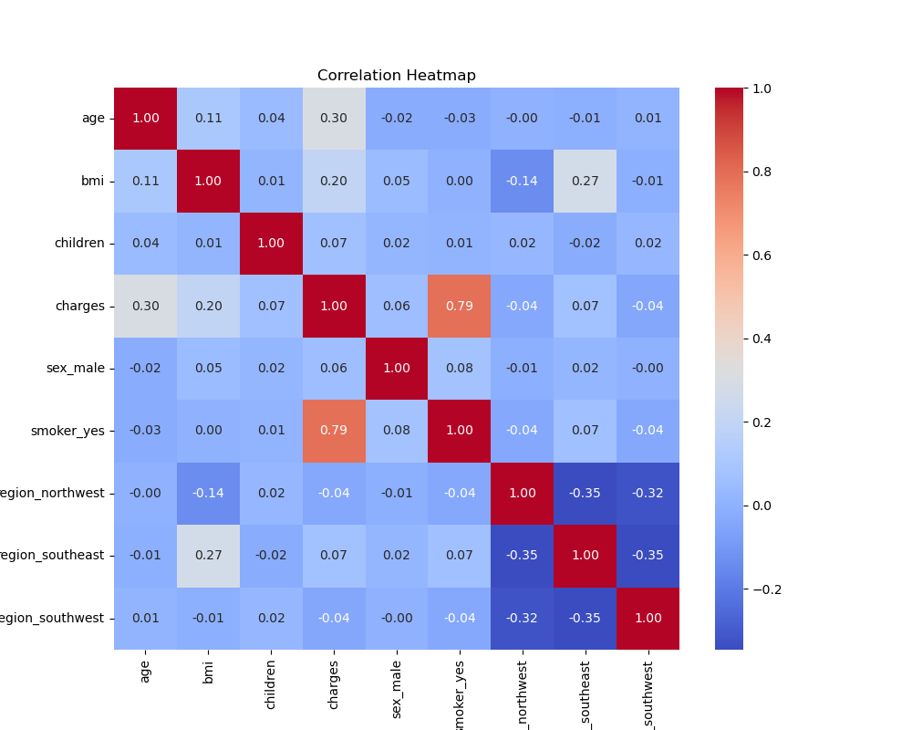
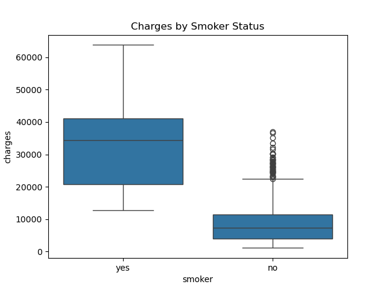
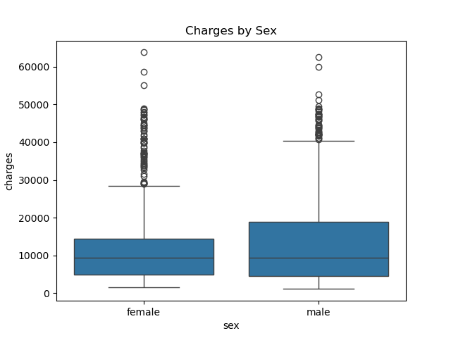
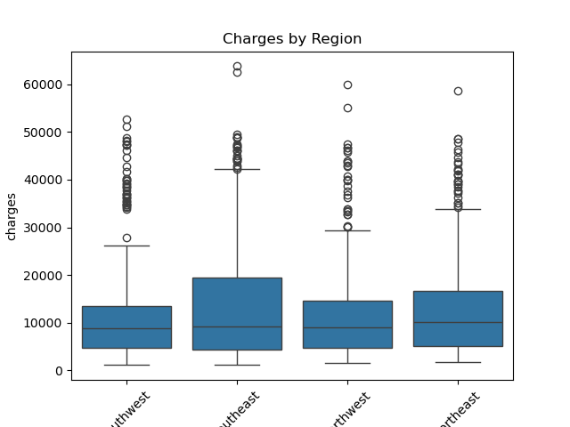
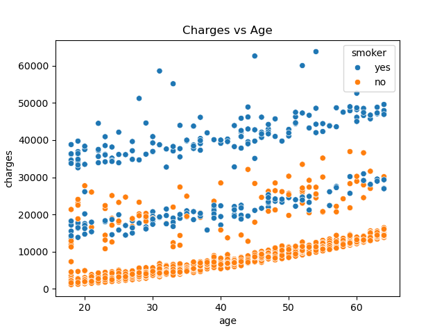
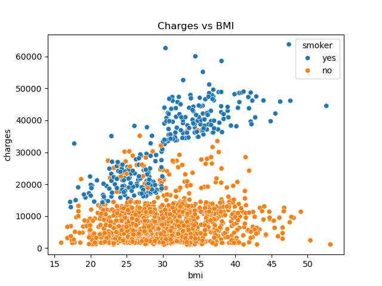

 <h1 align="center"> 🏥Medical Insurance Premium Prediction </h1>

Globally, health insurance costs are on the rise, with significant increases projected across Asia-Pacific and North America. This project aims to address this challenge by using a Linear Regression model to predict medical insurance charges based on key demographic and lifestyle factors, including age, sex, BMI, number of children, smoking status, and region.

The workflow begins with setting up and querying the dataset using SQL, followed by exploratory data analysis (EDA) and predictive modeling using Python.

The project leverages widely-used data science libraries such as NumPy, pandas, scikit-learn, seaborn, and matplotlib.

## 🧠Key Features
- Used **MySQL** to structure and preview the dataset
- Performed **data preprocessing and EDA** using **pandas**, **matplotlib**, and **seaborn**
- Created **interaction terms** like `bmi_smoker` and `age_smoker` to capture the impact of smoking on BMI and age in predicting charges
- Built a **Linear Regression model** with **train/test split**
- Evaluated model performance using **R² score**
- Validated predictions on a separate dataset
- Used business rules to cap unrealistic predictions (e.g., minimum charge of $1000)

## 📊Data Description
  
- **age**: Age of the policyholder
- **sex**: Gender of the policyholder, either male or female
- **bmi**: Body Mass Index, a numeric value calculated from weight and height, used to classify underweight, normal, overweight, or obesity. A healthy BMI typically ranges from 18.5 to 24.9
- **children**: Number of dependents covered under the insurance plan
- **smoker**: Indicates whether the individual is a smoker (yes or no)
- **region**: Geographical region in the U.S. where the person resides (northeast, southeast, southwest, northwest)
- **charges**: Individual medical costs billed by health insurance

## 📊EXPLORATORY DATA ANALYSIS (EDA)
<h3 align="center"> Distribution of Insurance Charges </h3>

  

 The distribution of charges is right-skewed, with most charges falling under $15,000 but some reaching beyond $60,000. This suggests the presence of high-cost outliers, associated with specific risk groups (e.g. smokers or high-BMI individuals). 

<h3 align="center">  Correlation Heatmap </h3>

 The heatmap shows that smoking status, age and bmi have positive correlation with charges. 

<h3 align="center"> Charges by Smoker Status </h3>

 Smokers tend to incur significantly higher charges. The median charge for smokers is over 3x higher than for non-smokers, clearly establishing smoking as a strong predictor of medical expenses. 

<h3 align="center"> Charges by Sex </h3>

 There is no major difference in insurance charges between male and female policyholders. This supports the finding in the correlation matrix where sex_male has almost no relationship with charges. 

<h3 align="center"> Charges by Region </h3>

 Region does not play a significant role in determining insurance charges. All regions exhibit similar distributions with overlapping medians. 

<h3 align="center"> Charges vs Age (Colored by Smoker) </h3>

 Insurance charges increase with age, especially for smokers. Smokers tend to face much higher insurance charges as they get older compared to non-smokers, a key justification for creating interaction terms like 'age_smoker'. 

<h3 align="center"> Charges vs BMI (Colored by Smoker) </h3>

 For people who smoke, their BMI has a significant impact on the amount they are charged for insurance. This means that as a smoker's BMI increases, their insurance costs are likely to rise more noticeably. This interaction validates adding 'bmi_smoker' interaction term in the regression model. 

## 🧹Data Cleaning & Preparation
- Removed missing values
- Checked for duplicate rows - removed 1 duplicate row
- Converted categorical variables to numeric for machine learning:
  - Mapped 'smoker' from 'yes'/'no' to 1/0
  - Created a new binary column 'is_male' from 'sex'
  - One-hot encoded the 'region' variable and dropped the first category to avoid the dummy variable trap

## 📈Initial Regression Analysis
A linear regression model was fitted to the data using Statsmodels package to assess the individual impact of each predictor variable on insurance costs. 
### 🔎Statistical Findings
Variables with a statistically significant effect on charges **(p < 0.05)** included:
- Age: Older individuals tend to have higher insurance charges.
- BMI: Higher BMI levels are linked to increased medical costs.
- Children: Each additional child is associated with a moderate increase in charges.
- Smoker: The most impactful predictor, smokers face substantially higher charges.
- Region (Southeast and Southwest): Individuals in these regions are expected to pay slightly less compared to the reference region (Northeast).

Variables not statistically significant:
- Gender (is_male): No meaningful difference in charges between males and females.
- Region Northwest: No significant difference compared to the reference region.

#### Interpretation
The model confirms that **smoking status**, **age**, and **BMI** are major drivers of insurance costs. Smokers are expected to pay the highest premiums, followed by individuals with higher BMI and older age. People living in the **Southeast** or **Southwest** regions may benefit from slightly lower charges. In contrast, **gender** and living in the **Northwest** region did not appear to influence insurance costs in this sample dataset.

## 🤖Model Building with Scikit-learn
A linear regression model was developed using the scikit-learn library to estimate medical insurance charges based on individual characteristics. The dataset was split into training and testing sets using an 80/20 ratio to evaluate the model's out-of-sample predictive performance.

To account for potential interaction effects, two additional variables were introduced:
- **bmi_smoker**: interaction between body mass index (BMI) and smoking status
- **age_smoker**: interaction between age and smoking status

These terms were informed by exploratory scatter plots, which showed that the relationship between charges and both age and BMI differed significantly between smokers and non-smokers, suggesting a **moderating effect** of smoking on these variables.

After training, the model achieved an R² score of 0.865 on the test set, indicating that approximately 86.5% of the variation in insurance charges is explained by the model, suggesting that the model fits the data well and can make accurate prediction on new customer records. 

